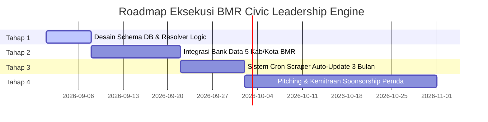

# 📜 RENCONTA (PLANNING): BMR CIVIC LEADERSHIP & ADAT HONORIFIC ENGINE
## Sistem Sapaan Kehormatan Adat & Otomatisasi Pembaruan Data Pejabat Bolaang Mongondow Raya (BMR) di Bogani AI (Abo')

---

## 📌 1. Ringkasan Eksekutif (Executive Summary)

Dokumen rencana (*planning specification*) ini merancang arsitektur sistem **Sapaan Kehormatan Personal & Otomatisasi Bank Data Pejabat BMR** pada platform **MongondowPedia (Ginza Project)**.

Sistem ini dirancang untuk memberikan pengalaman kecerdasan buatan (**Bogani AI / Abo'**) yang sangat personal, menjunjung tinggi kearifan lokal adat Mongondow (*Kinomang / Po'ogon*), dan menjadi **Nilai Tawar Utama (Killer Feature for Sponsorship)** dalam menjalin kemitraan dengan 5 Pemerintah Daerah se-Bolaang Mongondow Raya (BMR):
1. **Kabupaten Bolaang Mongondow Timur (Boltim)**
2. **Kabupaten Bolaang Mongondow Utara (Bolmut)**
3. **Kabupaten Bolaang Mongondow Selatan (Bolsel)**
4. **Kabupaten Bolaang Mongondow (Bolmong)**
5. **Kota Kotamobagu**

---

## 🎭 2. Matriks Sapaan Kehormatan Adat & Struktural (Honorific Matrix)

Bogani AI (Abo') akan secara otomatis mendeteksi role, gelar adat, maupun jabatan politik/pemerintahan pengguna saat pertama kali berinteraksi, dengan aturan sapaan sebagai berikut:

| Role / Jabatan User | Pola Sapaan Khusus Bogani AI (Abo') | Contoh Sapaan Langsung AI |
| :--- | :--- | :--- |
| **Founder & Admin** | **`Boss Bayu`** | *"Tabe' Boss Bayu! Ada instruksi baru untuk Bogani AI?"* |
| **Verifikator Adat** | **`Utat [Nama Depan]`** *(Dialek Totabuan: Saudara)* | *"Dega Niondon, Utat Rahmat! Terima kasih telah memverifikasi data kamus."* |
| **Pengguna Umum (User)** | **`Ka' [Nama Depan]`** | *"Niondon Ka' Fikri!" / *"Niondon kon MongondowPedia Ka' Fikri!"* |
| **Bupati / Walikota Aktif** | **`Pak Bupati [Nama]` / `Ibu Walikota`** | *"Tabe' Pak Bupati! Selamat datang di MongondowPedia."* |
| **Wakil Bupati / Walikota** | **`Pak Wakil Bupati [Nama]`** | *"Tabe' Pak Wakil Bupati!"* |
| **Pimpinan DPRD / Ketua** | **`Pak Ketua [Nama]` / `Ibu Ketua [Nama]`** | *"Tabe' Pak Ketua DPRD [Kabupaten]!"* |
| **Anggota DPRD Biasa** | **`Pak Dewan [Nama]` / `Ibu Dewan [Nama]`** | *"Tabe' Pak Dewan Rahman! Selamat datang." / *"Ibu Dewan Angel"* |
| **Camat** | **`Pak Camat [Nama]` / `Ibu Camat`** | *"Tabe' Pak Camat [Kecamatan]!"* |
| **Sangadi (Kepala Desa)** | **`Pak Sangadi [Nama]` / `Ibu Sangadi`** | *"Niondon Pak Sangadi [Desa]!"* |
| **Mantan Pejabat (Purna)** | **`[Jabatan] Guhanga [Nama]`** | *"Dega Niondon, Bupati Guhanga [Nama]! Kehormatan bagi Abo'."* |
| **Guru Sekolah** | **`Pak Guru [Nama]` / `Ibu Guru`** | *"Tabe' Ibu Guru! Salam hormat untuk pahlawan tanpa tanda jasa."* |

> 💡 **Kearifan Dialek Totabuan & Istilah Adat "Guhanga":**
> - **Utat** adalah sapaan hangat kekeluargaan khas dialek Totabuan yang berarti *Saudara/Sodara*, sangat pas dan akrab digunakan untuk menyapa para Verifikator Adat.
> - **Guhanga** merujuk pada sosok tetua, purna tugas, atau mantan pejabat yang dihormati atas jasa dan kepemimpinannya di masa lampau (*Bupati Guhanga*, *Sangadi Guhanga*).

---

## 🗄️ 3. Arsitektur Database & Skema Tabel Data Pejabat BMR

Untuk mendukung pencarian dan pengenalan otomatis, sistem akan dilengkapi dengan tabel database khusus `bmr_officials` yang terintegrasi dengan tabel `profiles` Supabase.

### 3.1 Skema Tabel `bmr_officials`
```sql
CREATE TYPE bmr_region_type AS ENUM ('boltim', 'bolmut', 'bolsel', 'bolmong', 'kotamobagu');
CREATE TYPE bmr_position_type AS ENUM ('bupati', 'wakil_bupati', 'walikota', 'wakil_walikota', 'dprd_pimpinan', 'dprd_anggota', 'camat', 'sangadi', 'guru', 'tokoh_adat');
CREATE TYPE bmr_official_status AS ENUM ('aktif', 'guhanga', 'mutasi');

CREATE TABLE bmr_officials (
    id UUID PRIMARY KEY DEFAULT gen_random_uuid(),
    user_id UUID REFERENCES auth.users(id) ON DELETE SET NULL,
    full_name VARCHAR(255) NOT NULL,
    short_name VARCHAR(100) NOT NULL,
    gender VARCHAR(10) CHECK (gender IN ('L', 'P')),
    region bmr_region_type NOT NULL,
    district VARCHAR(100), -- Kecamatan (untuk Camat / Sangadi / Guru)
    village VARCHAR(100),  -- Desa / Kelurahan (untuk Sangadi / Kades)
    school_name VARCHAR(255), -- Nama Sekolah (untuk Guru)
    position bmr_position_type NOT NULL,
    custom_title VARCHAR(100), -- e.g. "Bupati Guhanga Boltim"
    status bmr_official_status DEFAULT 'aktif',
    term_start_year INT,
    term_end_year INT,
    verified_by_admin BOOLEAN DEFAULT TRUE,
    created_at TIMESTAMP WITH TIME ZONE DEFAULT NOW(),
    updated_at TIMESTAMP WITH TIME ZONE DEFAULT NOW()
);
```

---

## 🔄 4. Engine Pembaruan Data Otomatis 3-Bulanan (Automated 3-Month Sync Engine)

Sistem akan secara otomatis menjaga kesahihan (*data validity*) pejabat daerah di 5 Kabupaten/Kota melalui **Cron Scheduler 3-Bulanan**:

```
 ┌────────────────────────────────────────────────────────┐
 │          Cron Job Scheduler (Tiap 3 Bulan)             │
 └──────────────────────────┬─────────────────────────────┘
                            │
                            ▼
 ┌────────────────────────────────────────────────────────┐
 │   BMR Data Sync Engine (Scraper & Portal API Sync)    │
 │   - Portal Resmi Pemkab Boltim, Bolmut, Bolsel,        │
 │     Bolmong, & Kota Kotamobagu                         │
 │   - Data Terbuka KPU / Kemendagri / BPS                │
 └──────────────────────────┬─────────────────────────────┘
                            │
                            ▼
 ┌────────────────────────────────────────────────────────┐
 │             Deteksi Perubahan Jabatan                  │
 ├────────────────────────────────────────────────────────┤
 │  • Pejabat Baru  ➡️ Set Status 'aktif'                  │
 │  • Pejabat Lama ➡️ Transisi Status ke 'guhanga'        │
 └──────────────────────────┬─────────────────────────────┘
                            │
                            ▼
 ┌────────────────────────────────────────────────────────┐
 │       Update Bank Data & Invalidate Cache AI           │
 └────────────────────────────────────────────────────────┘
```

### Komponen Pengkinian Data:
1. **Web Scraper & Portal API Connector:** Service otomatis berbasis TypeScript/Node.js yang membaca pembaruan struktur organisasi daerah dari situs resmi 5 Pemkab/Pemkot.
2. **Admin Verification Dashboard:** Panel khusus di Admin Dashboard `/dashboard` bagi tim pengelola untuk meninjau hasil pencocokan data sebelum diaktifkan secara otomatis.
3. **Manual Override:** Admin dapat mengubah status pejabat secara manual dalam hitungan detik apabila terjadi pergantian antar-waktu (PAW) atau pelantikan mendadak.

---

## 🧠 5. Integrasi Prompt Injection pada Bogani AI (Abo')

Ketika percakapan dimulai pada endpoint `/api/homepage/chat`:

1. **Honorific Resolver Module:**
   Service backend mendeteksi sesi pengguna:
   - Apabila ID User = Admin ➡️ Sapaan = `Boss Bayu`
   - Apabila User Role = Verifikator ➡️ Sapaan = `Bro [Nama Depan]`
   - Apabila User terdaftar di `bmr_officials` ➡️ Resolusi Sapaan sesuai Jabatan (`Pak Sangadi`, `Bupati Guhanga`, dll.)
   - Apabila User biasa ➡️ Sapaan = `Ka' [Nama Depan]`

2. **Format System Prompt Injection:**
   ```text
   --- ATURAN SAPAAN PERSONAL PENGGUNA ---
   PENGGUNA SAAT INI: [Nama Lengkap User]
   STATUS / JABATAN: [Contoh: Sangadi Desa Kotabunan / Bupati Guhanga]
   SAPAAN WAJIB BOGANI AI: "[Pola Sapaan Wajib, misal: 'Pak Sangadi' atau 'Bupati Guhanga']"
   
   ATURAN: Gunakan sapaan ini di awal balasan percakapan secara alami dan penuh rasa hormat.
   --- AKHIR ATURAN SAPAAN ---
   ```

---

## 💼 6. Nilai Tawar Strategic untuk Sponsorship 5 Pemkab BMR

Dokumen gagasan ini menjadi materi pendukung utama (*Pitch Deck Material*) saat mendatangi 5 Kabupaten/Kota:

1. **Digitalisasi Kebudayaan Modern:** Menunjukkan bahwa Pemkab/Pemkot mendukung pelestarian bahasa Mongondow berbasis teknologi kecerdasan buatan tercanggih.
2. **Penghormatan Kepada Tokoh Daerah & Guhanga:** Menunjukkan apresiasi tinggi sistem terhadap pimpinan daerah aktif maupun purna tugas (*Guhanga*).
3. **Integrasi Data Wilayah BMR:** Menyajikan profil lengkap seluruh kecamatan, desa/kelurahan, dan lembaga pendidikan di 5 Kabupaten/Kota BMR.
4. **Platform Terpercaya:** Menjamin data pimpinan daerah selalu akurat dan diperbarui berkala setiap 3 bulan.

---

## 🗺️ 7. Tahapan Rencana Eksekusi (Execution Roadmap)



---

## 📑 Catatan Akhir

Rencana (*planning*) ini telah terdokumentasi secara penuh, terstruktur, dan siap dieksekusi kapan pun Boss Bayu memberikan instruksi pengaktifan fitur.

*Dokumen ini disusun untuk Proyek MongondowPedia (Ginza Project) — Hak Cipta © 2026 Boss Bayu & Team.*
